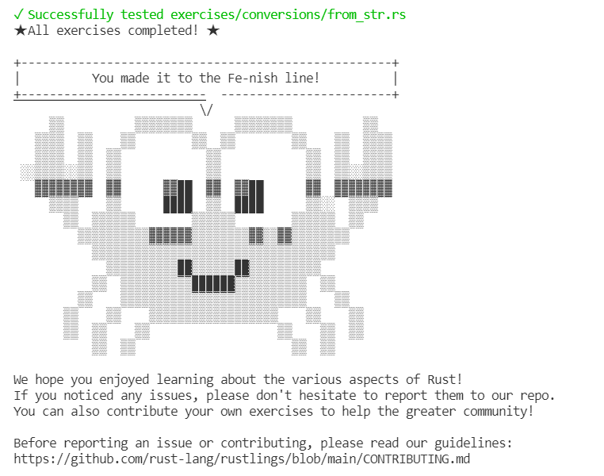
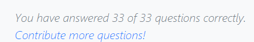

# OS夏令营2021记录

|时间| 学习内容                   | 一点点感悟                     |
| :------------------------: | :------------------------: | :----------------------------: |
|6-29| 复习了一下github的简单使用 | 每次学完太久不用就会忘记，哭了 |
|7-1|做rustlings到quiz1.rs|目前的内容还比较友好|
|7-3|做rustlings到errorsn.rs|预计明天结束rustlings|
|7-8|rustlings完结|开始学risc-v，同时做rust其他练习|
|7-17|rust-quiz完结|开始rcore tutorial|

## day1(2021-6-29)

昨天交了简历和报名表，今天去学校领了毕业证和学位证，本科阶段告一段落了，接下来的一段时间应该会有很多时间来学习OS。由于暂时还没收到夏令营的反馈，那就先建个README.md吧。

## day2(2021-7-1)

今天收到了邮件反馈，很激动！晚上回家下载了rustlings文件夹开始做练习，里面的练习确实很基础，因为时间很晚了，就暂时先做了几个。明天继续！

## day3(2021-7-3)

今天做rustlings到errorsn.rs，同时结合之前看完的rust book和文档复习了一下有疑惑的部分，预计明天结束rustlings

## day4(2021-7-8)

rustlings完结撒花，接下来继续开始学习risc-v，同时复习rust的其他练习

## day5(2021-7-17)

rust-quiz完结，开始risc-v和rcore tutorial

